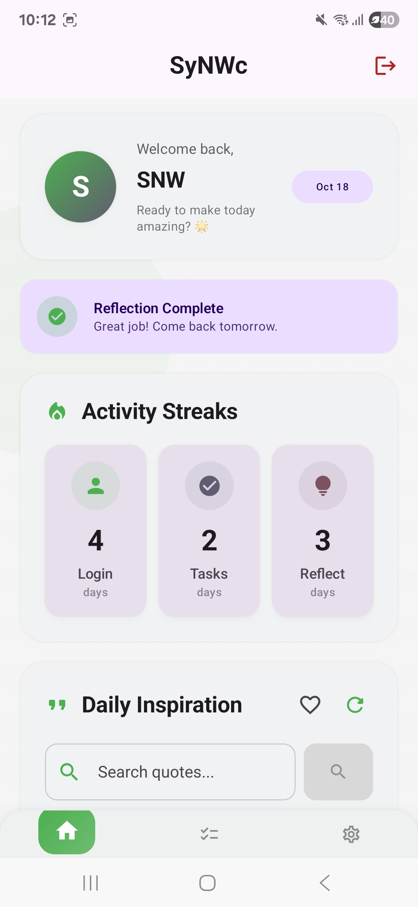
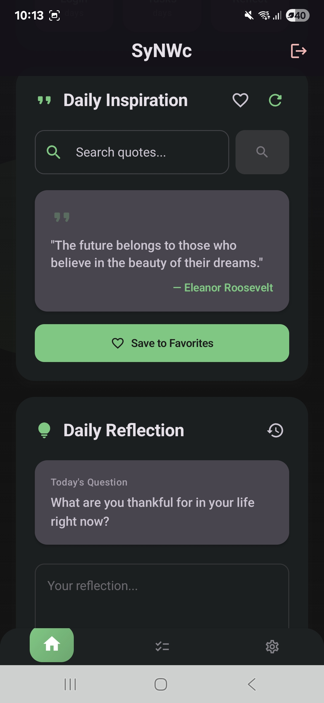
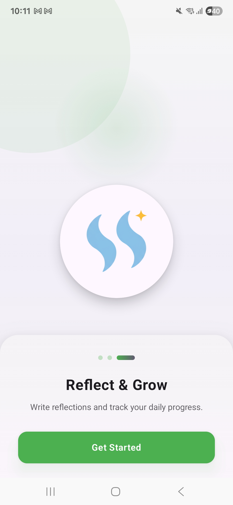
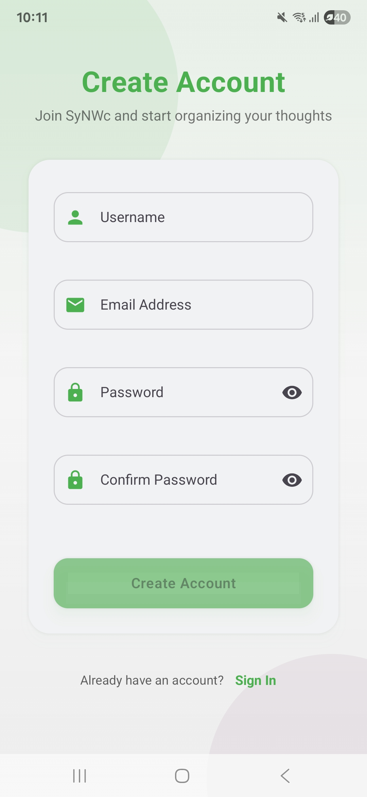
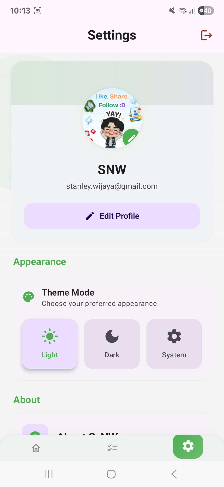
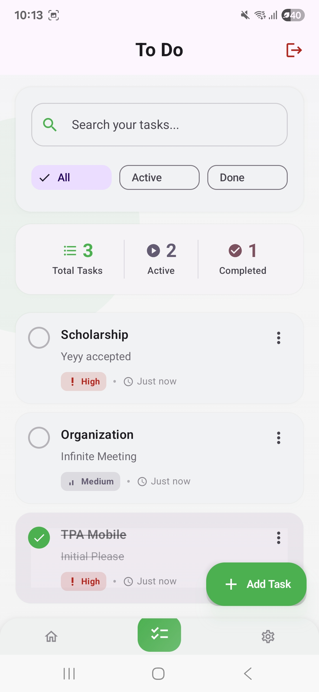

<h1 align="center"> SyNWc </h1> <br>
<p align="center">
    
</p>

<p align="center">
  <b>TPA Mobile Project</b>
  <br>
  95.16 / 100 (Duration: 2 weeks)
  <br>
  <b>SyNWc</b> (Sync Your Notes With Clarity) is a <b>simple self-love Android mobile app</b> built with <b>Kotlin</b> and <b>Jetpack Compose</b>, helping users to reflect, grow, and maintain daily mindfulness through personal reflections, motivational quotes, and to do tracking.
</p>

---

## 📃 Table of Contents
- [Introduction](#🌟-introduction)
- [Technology Stack](#🛠️-technology-stack)
- [Core Features](#🧩-core-features)
- [Live Demo](#🚀-live-demo)
- [Getting Started Locally](#🧰-getting-started-locally)
- [Screenshots](#📸-app-preview)
- [Owner](#👥-owner)
- [Contact](#📬-contact)


---


## 🌟 Introduction

**SyNWc** is a mindfulness companion app that inspires users to practice daily self-love, reflection, and productivity.  
It offers a simple yet meaningful space to:
- Set and complete daily goals  
- Reflect on personal growth  
- Find daily motivational quotes  
- Track emotional and mental consistency through streaks  

> “Love yourself, reflect daily, and grow a better you — one day at a time.”

---

## 🛠️ Technology Stack

- **Language**: Kotlin  
- **Framework**: Jetpack Compose  
- **Architecture**: MVVM (Model-View-ViewModel)  
- **Backend**: Firebase Firestore Database + Firebase Authentication  
- **UI Components**: Material 3 Design, Accompanist Pager  
- **Dependency Management**: Gradle with Version Catalog (`libs.versions.toml`)  
- **IDE**: Android Studio Meerkat | 2024.3.2

---

## 🧩 Core Features

### 🚀 **Onboarding Page**
- Engaging onboarding flow to introduce the app and encourage new users.
- Smooth page transition using Accompanist Pager.
- “Get Started” button navigates users directly to the login page.

---

### 🔐 **Authentication Page**
- Firebase Authentication integration (Email & Password).
- Secure Login and Register functionality.
- Input validation with error messages (invalid login, empty fields, password mismatch).
- Password visibility toggle for better UX.

---

### 🏠 **Home Page**
#### ✨ Quote Generator
- Generate a **random daily motivational quote** from curated lists.
- Encourages positivity and daily inspiration.

#### 🪞 Daily Reflection Prompt
- Generates a **daily reflection question**.
- Users can write their responses which are saved to **Firebase Realtime Database**.
- Past reflections can be viewed later in Notes.

#### 🔥 Streak System
- Tracks consecutive days users complete reflections or to-do lists.
- Encourages consistency and personal growth.

---

### 📝 **To-Do List Page**
- Full CRUD (Create, Read, Update, Delete) functionality for daily tasks.
- Modern UI with smooth animations and swipe actions.
- Tracks completion progress and updates streak count automatically.

---

### ⚙️ **Settings Page**
- **Profile Settings:** Update name, email, and other profile details stored in Firebase.
- **Theme Controls:** Toggle between **Light** and **Dark mode** (saved locally using DataStore Preferences).

---

## 🚀 Live App
Visit the apk-debug here:  
👉 [Download apk here](https://drive.google.com/file/d/1y8LPZPnhPcRyjFCbnIn8Fr1YL-BhB_xq/view?usp=sharing)

Download the application from Play Store here:
👉 [Download Synwc App](https://play.google.com/store/apps/details?id=edu.bluejack25_1.synwc&pcampaignid=web_share)

---

## 🧰 Getting Started Locally

### Prerequisites
- **Android Studio Ladybug (2024.2.1)** or newer  
- **JDK 17+**  
- **Firebase Account** with created project  
- **Internet Connection**

### Clone (Setup Locaclly)
```bash
git clone https://github.com/StyNW7/TPA-SyNWc.git
cd synwc
add google-services.json
run based on kotlin configuration using Android Studio min sdk 35
```

---

## 📸 App Preview
<table style="width:100%; text-align:center">
    <col width="100%">
    <tr>
        <td width="1%" align="center"></td>
    </tr>
    <tr>
        <td width="1%" align="center">Home Page - Light Mode</td>
    </tr>
    <tr>
        <td width="1%" align="center"></td>
    </tr>
    <tr>
        <td width="1%" align="center">Home Page - Dark Mode</td>
    </tr>
    <tr>
        <td width="1%" align="center"></td>
    </tr>
    <tr>
        <td width="1%" align="center">Onboarding Page</td>
    </tr>
    <tr>
        <td width="1%" align="center"></td>
    </tr>
    <tr>
        <td width="1%" align="center">Register Page</td>
    </tr>
    <tr>
        <td width="1%" align="center"></td>
    </tr>
    <tr>
        <td width="1%" align="center">Settings Page</td>
    </tr>
    <tr>
        <td width="1%" align="center"></td>
    </tr>
    <tr>
        <td width="1%" align="center">To Do List Page</td>
    </tr>
</table>

---

## 👥 Owner

This Repository is created by (Project last modified Saturdary, 18 October 2025, 12:00):
- Stanley Nathanael Wijaya (NW25-1)

---

## 📬 Contact
Have questions or want to collaborate?

- 📧 Email: stanley.n.wijaya7@gmail.com
- 💬 Discord: `stynw7`

<code>Yeyy last TPA Done ❤️‍🔥 </code>
